# VIPM-Configuration

## Configuration Files

*LabVIEW method calls:* 
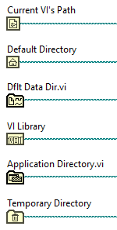

*Key:* 
Left: Ran using **package** 
Right: Ran using **source**

- `Current VI's Path` 
    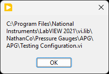
    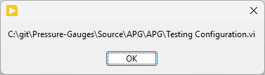

- `Default Directory` 
    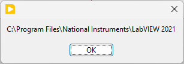
    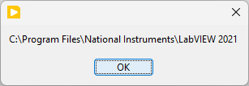

- `Default Data Dir` 
    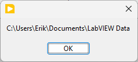
    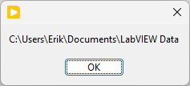

- `VI Library` 
    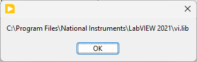
    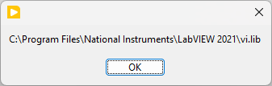

- `Application Directory` 
    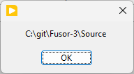
    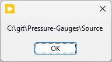

- `Temporary Directory` 
    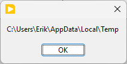
    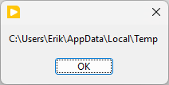

### Example

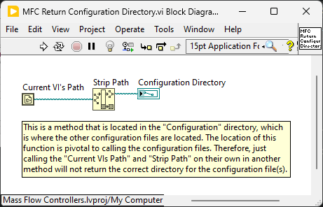 
*This is the method called in the code that lives in the same directory as the configuration files*

**Source:**

> `Source Directory = C:\git\Mass-Flow-Controllers\Source\Configuration`
>
> **Return Configuration Directory.vi:** 
> `Source Directory`
>
> **Configuration File Location:** 
> `Source Directory`\MKS Gas Correction Factors for Thermal-based Mass Flow.tsv

**Package:**

> `Package Directory = C:\Program Files\National Instruments\LabVIEW 2021\vi.lib\NathanCo\Mass Flow Controllers\Configuration`
>
> **Return Configuration Directory.vi:** 
> `Package Directory`
>
> **Configuration File Location:** 
> `Package Directory`\MKS Gas Correction Factors for Thermal-based Mass Flow.tsv

# Creating a LabVIEW Github

After creating a new project: 
1. ***Check***: Separate compiled code from new project items
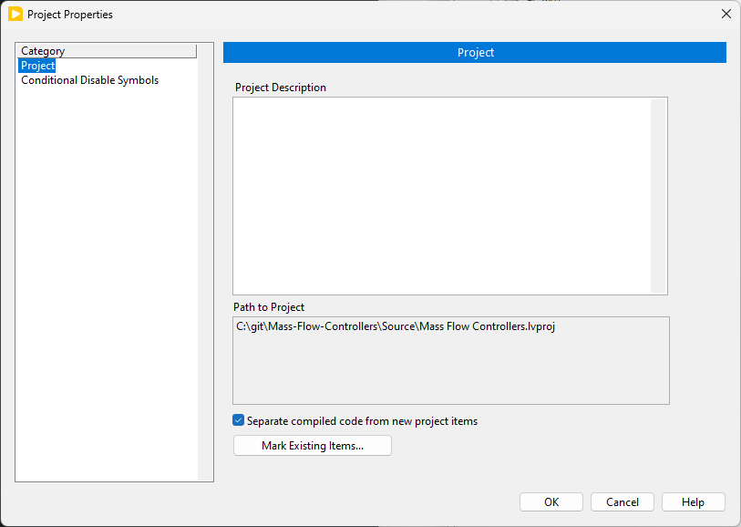

# Namespace resolved

namespace issue in dependencies.. you have to choose between the two APG or MFC configuration method

name space issues in dependencies.. everything in a library that will be put into a package..
have an upper level library: `NathanCo Mass Flow Controllers.lvlib` and within this library are all of the source files. This gets rid of the naming convention
what do others use in VIPM for package naming conventions

`NathanCo.lvlib` that holds the `Mass Flow Controllers.lvlib`

# Off Topic: Decoupling Ideas (Temporal Order)

> **NI_ChannelName independence**
>
> For each Nested Actor, have a:
> - “Nest”(Cluster)
> - “APG”(Cluster)
> - “Roughing”(Cluster)
> - “Message Enqueuer”(Message Enqueuer)
> - “NI_ChannelName”(String)
> 
> MFC and Pressure Gauges should not need to know about the “NI_Channel Name” in their private data
This data is parsed at the Top Level, may slow things down.. but there aren’t many messages so this is fine

> I suppose on the same coin.. 
> Put the sun panels in the same cluster as the “Nest”(Cluster)

> Should there really be a cluster that holds the Nested Actors? 
> Instead have a Nested Actors(map) with: 
> “Name”(String):”Attributes”(Cluster) 
> 
> In Analog Input: 
> Waveform Map.vi 
> “ChannelName”(String):”Waveform”(Waveform) 
> Waveform Array in 
> Check attribute for NI_ChannelName, make this String in map: append Waveform as value pair 
> Map out

> Isn’t everything just a SubPanel or Panel? 
> Just pass in a Not-a-refnum reference and mark show as false if not a SubPanel or Panel. 
> That way everything has a UI Ref / Panel??

> In Fusor 3: 
> No set data type needed, just loop through the array of waveforms and send each to the respective actor. Each actor still implements the Analog Input interface message.

> Have the tasks be created ahead of time with aliases.. then a map is created that maps the name of the channel to the alias 
> This is the interface between the two

> For a plugin architecture, loading off disc.. 
> Have methods within that simply gets the path name of the class 
> *Method within Class, same directory* 
> That way the wire is an interface inheritance

> Dynamically creating things in maps 
> Enter “Object Mapping Toolkit” 
> Dynamically create maps with Dynamic Dispatch Objects and interface inheritance 
> So interestingly enough since maps are static, you can make an assortment of maps in multiple objects composed into a central Map object.
>
> Does this require the user to continually know about the maps Key value pairs on the inside.. 
> NO! Since the key(strings) of all that maps, on every operation are updated in the Central Map Object private data Set of Strings
>
> Note that of course, this mapping MUST be 
> “key”(string):”value”(any) pairs where the key is always a string

> **State Pattern** 
> In Context, these are the SAME names as the Interface State Methods 
> This is because State is tightly coupled to Context, and the same naming convention is very easy to follow. 
> Think of Context implementing the methods, and State just has the same methods that have the core functionality

> Incoming / Outgoing Messages Palette 
> On disk, since one package uses another (such as the APG uses the Analog Input Package) then on the palette, navigate to the package and select the message from the reuse component
>
> User should not care about NI_ChannelName in APG, rather this is done at the top level creating the set for Name / Waveform